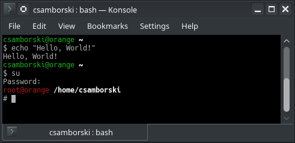

# Customization

## Command prompt

The following prompt displays the user and host in green, followed by the path of the current
working directory in bold white. The prompt symbol is on a new line.
The goal of the bold path and prompt on a new line is to better see the distinct commands.



Include the following lines in your `.bashrc` file:

```bash
# Better prompt for a normal user
color_prompt=yes
if [ "$color_prompt" = yes ]; then
    PS1='\e[32m\u@\h\e[0m \e[1m\w\e[0m\n\$ '
else
    PS1='\u@\h \w\n\$ '
fi
unset color_prompt
```

I also include the following code in the _root_'s `.bashrc` file. Instead of displaying the
username and host in green, it displays it in red so I can easily see that I am not using my
user account.

```bash
# Better prompt for root
color_prompt=yes
if [ "$color_prompt" = yes ]; then
    PS1='\e[31m\u@\h\e[0m \e[1m\w\e[0m\n\$ '
else
    PS1='\u@\h \w\n\$ '
fi
unset color_prompt
```

### Explanation

The username, host and working directory are defined with the symbols `\u`, `\h` and `w`.
The full list is in the _Prompting_ section of [the `bash` entry for `man`][man-bash].

The color is handled with a _Select Graphic Rendition_ (SGR) control sequence.

The sequence starts with a _Control Sequence Introducer_ (CSI) entity. There are two ways to
represent it:

- A sequence of two characters:
  - [Codepoint `0x1b`][unicode-1b]: `` (_ESCAPE_)
  - [Codepoint `0x5b`][unicode-5b]: `[` (_LEFT SQUARE BRACKET_)
  
  This is represented by the string `\e[` in the code above.

- A single character:
  - [Codepoint `0x9b`][unicode-9b]: `›` (_CONTROL SEQUENCE INTRODUCER_)
  
  It's not easy to type, so I prefer the first way (`\e[`).

A control sequence contains digits with some separators and ends with a _final byte_ indicating the
type of control sequence. SGR corresponds to [the codepoint `0x6d`][unicode-6d]: `m` (_LATIN SMALL
LETTER M_).

The string of digits and separators between the CSI and _final byte_ represents the style to apply.
Here are the styles I used:

- `0`: default rendition
- `1`: bold
- `31`: red display
- `32`: green display

You can find all the SGR codes (and other information I mentioned here) in
[the ECMA 48 standard][ecma-48-select-graphic-rendition].

### Enhancements

Here are some ideas to enhance this prompt:
- Display the exit code of the last command.
- Write the command in bold but return to default style for execution.

## Colored `ls` output

Include the following lines in your `.bashrc` file to display colored output.

```shell
export LS_OPTIONS='--color=auto'
# `dircolors` generates a command to export the `LS_COLORS` environment variable.
eval "`dircolors`"
alias ls='ls $LS_OPTIONS'
```

## ISO time for `ls`

Include the following lines in your `.bashrc` file to display time in ISO format with `ls`.

```shell
export TIME_STYLE=long-iso
```


[unicode-1b]: http://www.fileformat.info/info/unicode/char/1b/index.htm
[unicode-5b]: http://www.fileformat.info/info/unicode/char/5b/index.htm
[unicode-6d]: http://www.fileformat.info/info/unicode/char/6d/index.htm
[unicode-9b]: http://www.fileformat.info/info/unicode/char/9b/index.htm
[man-bash]: https://linux.die.net/man/1/bash
[ecma-48-select-graphic-rendition]: http://www.ecma-international.org/publications/files/ECMA-ST/Ecma-048.pdf#page=75
