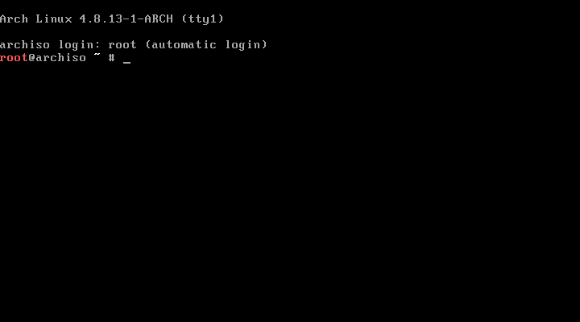

# Arch installation

[Official guide](https://wiki.archlinux.org/index.php/installation_guide).

This guide is target at my personal configuration.

If you are installing it on Virtual Box, make sur to enable `EFI` before starting the installation.

## Boot



## Keyboard layout

The default keyboard layout is `us`. For a table between AZERTY and QWERTY
keys, [see the AZERTY-QWERTY cheatsheet](../../../other/azerty-qwerty.md).

Display the available keyboard layouts (use `q` to quit, the key depends on your layout):

```shell
# Run as a normal user
ls /usr/share/kbd/**/*.map.gz | less
```

The name of the keyboard layout is the base name of the corresponding file (everything between
the last `/` and next `.`).

For exemple, the layout `fr` corresponds to the file `/usr/share/kbd/keymaps/i386/azerty/fr.map.gz`.

Change the keyboard layout for the current session:
```shell
# Run as a normal user
loadkeys <basename>
```

Example:
```terminal
$ loadkeys fr
```

## Basic configuration of the system clock

This configuration will only last for the installation. You will need to ensure that the clock
is properly configured once the system is installed.

### Check the status

```shell
# Run as a normal user
timedatectl status
```

### Network synchronization

Enable the Network Time Protocol (requires Internet) to synchronize the clock:

```shell
# Run as root
timedatectl set-ntp true
```

The synchronizatin may take a few seconds.
Once the clock is synchronized, the status should display `NTP synchronized: yes`.

Example:
```terminal
# timdatectl set-ntp true
$ timedatectl status
      Local time: Tue 2017-01-17 13:54:23 UTC
  Universal time: Tue 2017-01-17 13:54:23 UTC
        RTC time: Tue 2017-01-17 13:54:21
       Time zone: UTC (UTC, +0000)
 Network time on: yes
NTP synchronized: yes
 RTC in local TZ: no
```

## Partition the disks

Each recognized disk is represented by a _block device_ such as **/dev/sda**, **/dev/sdb**, etc.
The disks ending in `loop`, `rom` or `airoot` can be ignored.

List the disks with informations with:
```shell
# Run as root
fdisk -l
```

Example
```terminal
# fdisk -l
Disk /dev/sda: 8 GiB, 8589934592 bytes, 16777216 sectors
Units: sectors of 1 * 512 = 512 bytes
Sector size (logical/physical): 512 bytes / 512 bytes
I/O size (minimum/optimal): 512 bytes / 512 bytes

Disk /dev/loop0: 360.3 MiB, 377839616 bytes, 737968 sectors
Units: sectors of 1 * 512 = 512 bytes
Sector size (logical/physical): 512 bytes / 512 bytes
I/O size (minimum/optimal): 512 bytes / 512 bytes
```

- https://wiki.archlinux.org/index.php/Partitioning
- https://wiki.archlinux.org/index.php/GNU_Parted

### Planning

See [partitions](../../partitions.md) to find which configuration you need.

### Parted

To configure the partitions of the devide `<device-block>`, start an interactive _parted_ session.
You can quite it with an `EOF` character on a blank line (`Ctrl` + `D`) or `quit`.

```shell
# Run as root
parted <device-block>
```

Example

```terminal
# parted /dev/sda
```

List information about the current device:
```parted-shell
print
```

Initialize the partitions table of the device:
```parted-shell
mklabel gpt
```

Example:
```parted-terminal
(parted) mklabel gpt 
```

Create a partition:
```parted-shell
mkpart <partition-type> <fs-type> <start-offset> <end-offset>
```
- start-offset: Offset since the start of the disk: decimal number followed by a unit (`s` - sectors, `B`, `GiB`, `MiB`)
- end-offset: Offset since **the start of the dist**: decimal number followed by a unit. You can use `100%` to match the end.

#### UEFI Boot partition

We leave one free MiB at the start for the disk data.

```parted-shell
mkpart ESP fat32 1MiB 513MiB
set <partition> boot on
```
- partition: the number of the partition (example: `1`, `2`), see `print`.

#### Linux swap

```shell
mkpart primary linux-swap 513MiB 1537MiB
```

(There are two types of linux-swap: v0 and v1, this is why `print` displays the version)

#### Root partition

```shell
mkpart primary ext4 1537MiB 100%
```

VirtualBox:
1024MiB RAM, 8GiB disk:
```parted-shell
(parted) mklabel gpt
(parted) mkpart primary fat32 1MiB 513MiB
(parted) name 1 efiboot
(parted) set 1 boot on
(parted) mkpart primary linux-swap(v1) 513MiB 1537MiB
(parted) name 2 swap
(parted) mkpart primary ext4 1537MiB 100%
(parted) name 3 arch
(parted) print
Model: ATA VBOX HARDDISK (scsi)
Disk /dev/sda: 8590MB
Sector size (logical/physical): 512B/512B
Partition Table: gpt
Disk Flags:

Number  Start   End     Size    File system     Name     Flags
 1      1049kB  538MB   537MB   fat32           efiboot  boot, esp
 2      538MB   1612MB  1074MB  linux-swap(v1)  swap
 3      1612MB  8589MB  6977MB  ext4            arch

(parted) quit
Information: You may need to update /etc/fstab.

```

### Verification of the partitions

You can check the partitions:
```shell
# Run as root
fdisk -l
```

Example:
```terminal
# fdisk -l
Disk /dev/sda: 8 GiB, 8589934592 bytes, 16777216 sectors
Units: sectors of 1 * 512 = 512 bytes
Sector size (logical/physical): 512 bytes / 512 bytes
I/O size (minimum/optimal): 512 bytes / 512 bytes
Disklabel type: gpt
Disk identifier: C0FA4234-34D5-4EA8-BD19-2EE71DB8FE91

Device       Start      End  Sectors  Size Type
/dev/sda1     2048  1050623  1048576  512M EFI System
/dev/sda2  1050624  3147775  2097152    1G Linux swap
/dev/sda3  3147776 16775167 13627392  6.5G Linux filesystem


Disk /dev/loop0: 360.3 MiB, 377839616 bytes, 737968 sectors
Units: sectors of 1 * 512 = 512 bytes
Sector size (logical/physical): 512 bytes / 512 bytes
I/O size (minimum/optimal): 512 bytes / 512 bytes
```

### Format the partitions

Now that the partitions are created, you need to format them.

Example:
```terminal
# mkfs.fat -F32 /dev/sda1
mkfs.fat 4.0 (2016-05-06)
# mkswap /dev/sda2
Setting up swapspace version 1, size = 1024 MiB (1073737728 bytes)
no label, UUID=0f29ddf9-2ed6-41c4-869a-dec7ce18bf8e
# mkfs.ext4 /dev/sda3
mke2fs 1.43.3 (04-Sep-2016)
Creating filesystem with 1703424 4k blocks and 425984 inodes
Filesystem UUID: 5b2e43dd-2af7-420b-876a-3aa698b1c326
Superblock backups stored on blocks:
        32768, 98304, 163840, 229376, 294912, 819200, 884736, 1605632

Allocating group tables: done
Writing inode tables: done
Creating journal (16384 blocks): done
Writing superblocks and filesystem accounting information: done

```

## Bootstrapping

### Mount the partitions

You must now move from the live CD to the disk.

The first step is to mount the partitions to use on the live system.
We will mount the system on `/mnt/` during its configuration (you can use
any directory - its content will be hidden while the partition is mounted, but it has
to be created manually before):

```shell
# Run as root
# /mnt/ already exists (empty directory)
mount <root-partition> /mnt/
mkdir /mont/boot/
mount <boot-partition> /mnt/boot/
```

Example:
```terminal
# mount /dev/sda3 /mnt/
# mkdir /mnt/boot/
# mount /dev/sda1 /mnt/boot/
```

### Installation

Install the packages from the [_base_](https://www.archlinux.org/groups/x86_64/base/) package
group on the new system.

```shell
# Run as root
pacstrap /mnt/ base
```

This will install linux and the minimum set of packages to survive.

### fstab

You can pre-generate an /etc/fstab file for the new system with:
```shell
# Run as root
genfstab -U /mnt/ >> /mnt/etc/fstab
```
Then, check `/mnt/etc/fstab` manually.

Example:
```terminal
# cat /mnt/etc/fstab
#
# /etc/fstab: static file system information
#
# <file system> <dir>   <type>  <options>       <dump>  <pass>
# genfstab -U /mnt/ >> /mnt/etc/fstab
# cat /mnt/etc/fstab
#
# /etc/fstab: static file system information
#
# <file system> <dir>   <type>  <options>       <dump>  <pass>
# /dev/sda3
UUID=5b2e43dd-2af7-420b-876a-3aa698b1c326       /               ext4           rw,relatime,data=ordered 0 1

# /dev/sda1
UUID=D8E5-C628          /boot           vfat            rw,relatime,fmask=0022,dmask=0022,codepage=437,iocharset=iso8859-1,shortname=mixed,errors=remount-ro   0 2
```

[Change root](https://wiki.archlinux.org/index.php/Change_root) into the new system:

```shell
# Run as root
arch-chroot /mnt/
```

## Early configuration

You should be running in an _arch-chroot_ on disk.

### Packages

You need the following additional packages:

- grub
- efibootmgr
- intel-ucode
- net-tools

Install them with:

```shell
# Run as root
pacman -S <package>
```

### Locale

In **/etc/locale.gen**, uncomment `en_US.UTF-8 UTF-8`, then run:
```shell
nano /etc/locale.gen
locale-gen
```

Example
```terminal
# nano /etc/locale.gen
# locale-gen
Generating locales...
  en_US.UTF-8... done
Generation complete.
```

In **/etc/locale.conf**, set the `LANG` variable to `en_US.UTF-8`

```terminal
# cat /etc/locale.conf
cat: /etc/locale.conf: No such file or directory
# nano /etc/locale.conf
```

**/etc/locale.conf**
```text
LANG=en_US.UTF-8

```

### Keyboard layout

In **/etc/vconsole.conf**, persist the keyboard layout.

```terminal
# cat /etc/vconsole.conf
cat: /etc/vconsole.conf: No such file or directory
# nano /etc/vconsole.conf
```

**/etc/vconsole.conf**
```text
KEYMAP=fr

```

### Hostname

Choose a hostname, in `/etc/hostname`.
```terminal
# cat /etc/hostname
cat: /etc/hostname: No such file or directory
# nano /etc/hostname
```

**/etc/hostname**
```text
blue

```

Add your hostname to the **/etc/hosts** file

**/etc/hosts**
```text
#
# /etc/hosts: static lookup table for host names
#

#<ip-address>   <hostname.domain.org>   <hostname>
127.0.0.1	      localhost.localdomain	  localhost
::1		          localhost.localdomain	  localhost
::1             blue.localdomain        blue

# End of file

```

### Root password

```shell
# Run as root
passwd
```

### Install a bootloader

If you are using Virtualbox, you also need:

```terminal
# grub-install --target=x86_64-efi --efi-directory=/boot/ --bootloader-id=grub
Installing for x86_64-efi platform
Installation finished. No error reported.
# grub-mkconfig -o /boot/grub/grub.cfg
Generating grub configuration file ...
Found linux image: /boot/vmlinuz-linux
Found initrd image(s) in /boot: initramfs-linux.img
Found fallback initrd image(s) in /boot: initramfs-linux-fallback.img
done
# mkinitcpio -p linux
==> Building image from preset: /etc/mkinitcpio.d/linux.preset: 'default'
  -> -k /boot/vmlinuz-linux -c /etc/mkinitcpio.conf -g /boot/initramfs-linux.img
==> Starting build: 4.8.13-1-ARCH
  -> Running build hook: [base]
  -> Running build hook: [udev]
  -> Running build hook: [autodetect]
  -> Running build hook: [modconf]
  -> Running build hook: [block]
  -> Running build hook: [filesystems]
  -> Running build hook: [keyboard]
  -> Running build hook: [fsck]
==> Generating module dependencies
==> Creating gzip-compressed initcpio image: /boot/initramfs-linux.img
==> Image generation successful
==> Building image from preset: /etc/mkinitcpio.d/linux.preset: 'fallback'
  -> -k /boot/vmlinuz-linux -c /etc/mkinitcpio.conf -g /boot/initramfs-linux-fallback.img -S autodetect
==> Starting build: 4.8.13-1-ARCH
  -> Running build hook: [base]
  -> Running build hook: [udev]
  -> Running build hook: [modconf]
  -> Running build hook: [block]
==> wARNING: Possibly missing firmware for module: wd719x
==> wARNING: Possibly missing firmware for module: aic94xx
  -> Running build hook: [filesystems]
  -> Running build hook: [keyboard]
  -> Running build hook: [fsck]
==> Generating module dependencies
==> Creating gzip-compressed initcpio image: /boot/initramfs-linux-fallback.img
==> Image generation successful
```

If you have warnings about missing modules (as above), use:
```shell
modinfo <module-name>
```

#### Intel-CPU-specific step

You need to install a microcode (µcode) if you have an Intel CPU.

```shell
# Run as root
pacman -S intel-ucode
grub-mkconfig -o /boot/grub/grub.cfg
```

[Reference](https://wiki.archlinux.org/index.php/Microcode#Enabling_Intel_microcode_updates)

#### Virtualbox-specific step

If you use Virtalbox, you need to copy the grub configuration to `/EFI/BOOT/BOOTX64.EFI` on the
partition with the `esp` flag (currently mounted at `/boot/`).

```shell
# Run as root
cd /boot/
mkdir EFI/BOOT/
cp EFI/grub/grub.efi EFI/BOOT/BOOTX64.EFI
```

The Virtualbox resolution for startup is:
- Try to run `/EFI/BOOT/BOOTX64.EFI` on the partition with the `esp` flag.
- Try to run `/startup.nsh` on the partition with the `esp` flag.

If you want to use a `startup.nsh` file, create it: it should contain the path to the boot file:

**startup.nsh**
```shell
\EFI\grub\grubx64.efi
```

## Reboot

```shell
# Run as root
# Or Ctrl + D
exit
umount -R /mnt/
reboot
```

## First boot configuration

Then for Virtualbox:
```shell
pacman -S virtualbox-guest-utils-nox
# choose: virtualbox-guest-modules-arch
# (because it is a linux kernel)
```

DONE!
Now, install ALL the rest...

```shell
# Run as root
dhcpcd enp0s3
# Maybe: ?
# systemctl enable dhcpcd
```

