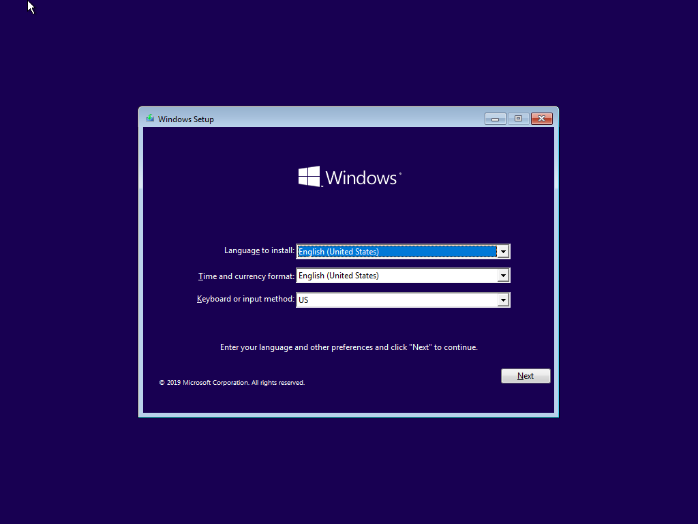
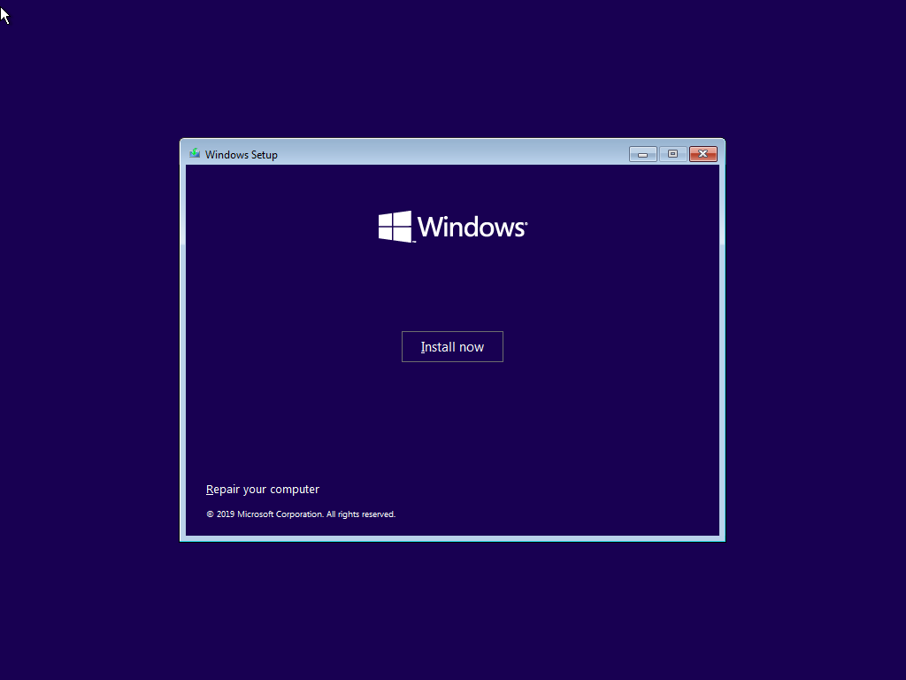
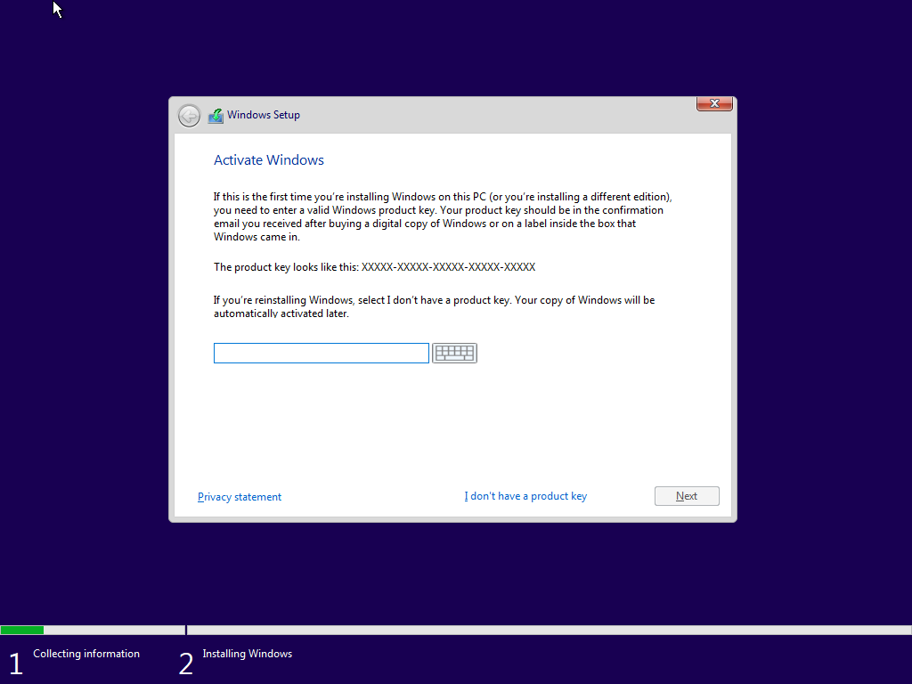
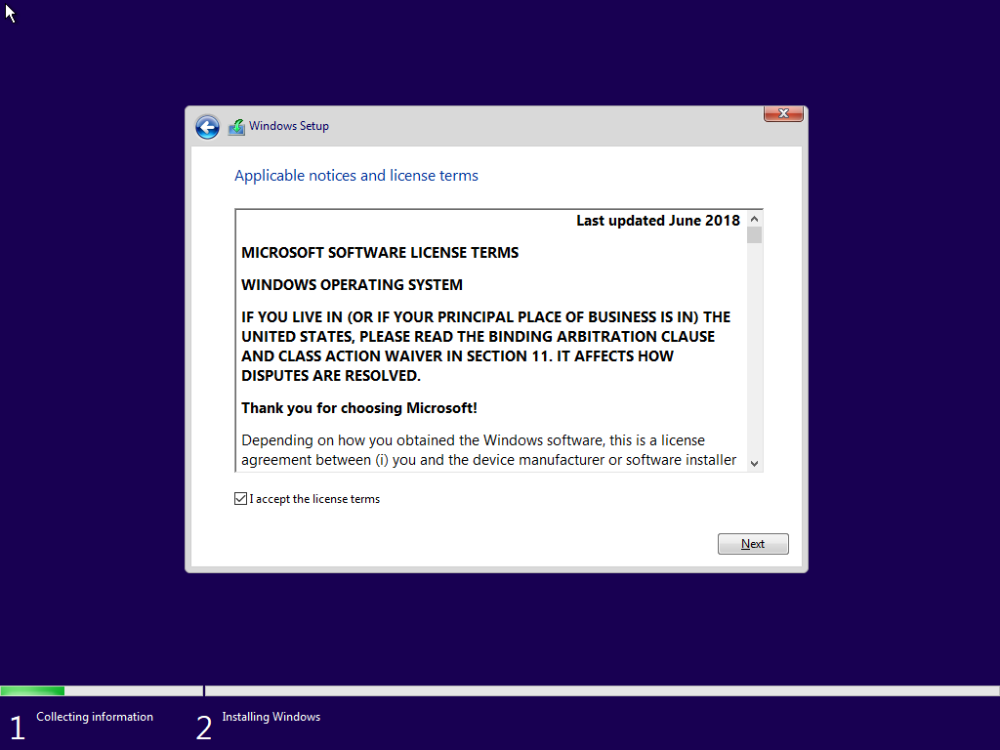
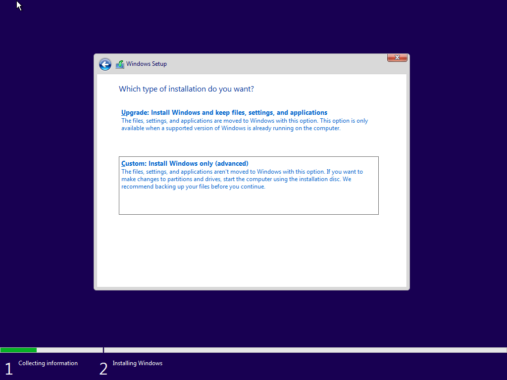
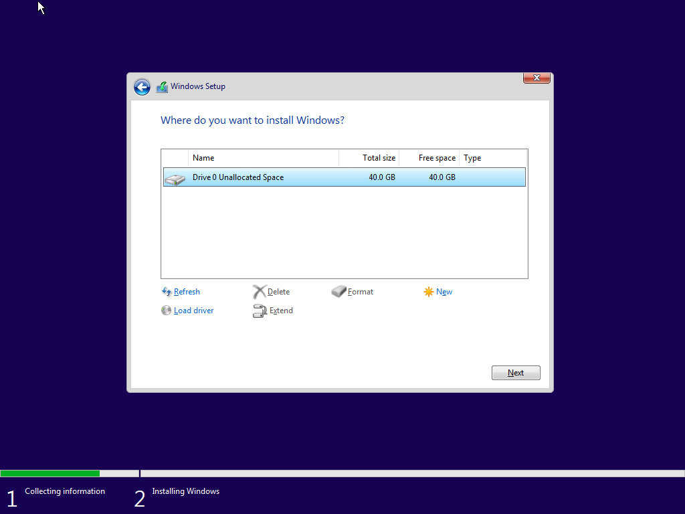

# Windows VM

## Dependencies

Install qemu and virt-manager, then start `libvirtd`.

```
pacman -S qemu libvirt virt-manager ebtables dnsmasq bridge-utils
systemctl start libvirtd
```

- qemu: Engine
- Virt Manager: GUI
- Libvirt: Abstraction layer used by Virt Manager
- ebtables, dnsmasq, bridge-utils: required for guest VM to access the network

## ISO Download

[Download the Windows 10 ISO](https://www.microsoft.com/en-us/software-download/windows10ISO).

## VM creation

- Path: `/data/virtual-machines/windows-10`
- RAM: 4 Gio
- CPU: 2 cores
- Disk: 40 Gio

## VM installation








After this, the installation starts. At the end, the VM restarts.

## References

- https://binarydebt.wordpress.com/2018/10/14/intel-virtualisation-how-vt-x-kvm-and-qemu-work-together/
- https://dennisnotes.com/note/20180614-ubuntu-18.04-qemu-setup/
- https://gist.github.com/Misairu-G/616f7b2756c488148b7309addc940b28
- https://gist.github.com/whizzzkid/37c0d365f1c7aa555885d102ec61c048

